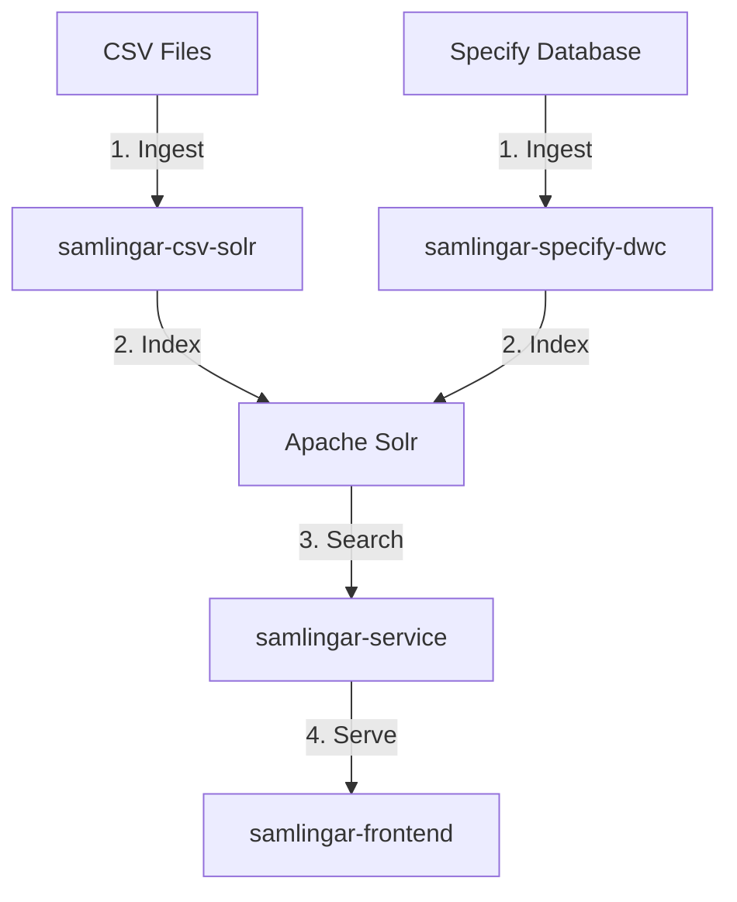

# Samlingar - Museum Collections Search Platform

[](https://opensource.org/licenses/MIT)

The **Samlingar - Museum Collections Search Platform** is a complete system for ingesting, indexing, searching, and presenting cultural heritage objects. It is built on a modular architecture to support scalability and maintainability.

## Architecture Overview

The system consists of independent components for data ingestion, search, API access, and the user interface.



## System Components

### 1. Data Ingestion (Indexers)
*   **samlingar-csv-solr**: A Java-based tool to read CSV files and index them into Solr.
*   **samlingar-specify-dwc**: A Java tool to extract records from a Specify database and index them into Solr.

### 2. Backend & Search
*   **Apache Solr**: The core search engine providing full-text search, faceting, and filtering.
*   **samlingar-service**: A Java RESTful API that acts as a secure abstraction layer over Solr, providing endpoints for the frontend.

### 3. Frontend
*   **samlingar-frontend**: A modern web application built with **Vue 3** and **Vite** for searching and browsing the collections.

---

## Prerequisites

*   **Java 8+** (for Indexers and API)
*   **Node.js 16+** (for Frontend)
*   **Apache Solr 8.x**
*   **Maven** (to build Java projects)

---

## Getting Started

### 1. samlingar-csv-solr
**Location:** `/samlingar-csv-solr`

To run the CSV indexer:
```bash
cd samlingar-csv-solr
java -jar -Dswarm.collection="paleo" -Dswarm.delect.collection=true samlingar-data-process/target/csvToSolr-thorntail.jar -Sinitdata
```

### 2. samlingar-specify-dwc
**Location:** `/samlingar-specify-dwc`

To run the Specify database indexer:
```bash
cd samlingar-specify-dwc
java -jar -Xms4096M -Xmx6144M -Dswarm.update=true specify-data-process/target/specifyToSolr-thorntail.jar -Sinitdata_ent
```

### 3. samlingar-service (API)
**Location:** `/samlingar_back/samlingar-service`

To build and run the API:
```bash
cd samlingar_back/samlingar-service
# Build the project (if needed)
mvn clean package

# Run the service
java -jar samlingar-api/target/samlingarApi-thorntail.jar -Sinitdata
```
The API will be available at: `http://localhost:8080/`

### 4. samlingar-frontend (UI)
**Location:** `/samlingar_frontend`

To run the frontend in development mode:
```bash
cd samlingar_frontend
npm install   # or yarn
npm run dev   # or yarn dev
```
Open your browser at: `http://localhost:5173/`

### 5. Apache Solr
Ensure Apache Solr is running and configured with the appropriate schema for museum collections.

**Features:**
*   Custom schema
*   Faceted navigation
*   Full-text search

---

## Production Deployment

Each component is designed to be containerized and directed via Docker or Kubernetes.
*   **Indexers**: Scheduled as cron jobs or CI/CD pipelines.
*   **Solr**: Dedicated container/cluster.
*   **API**: Backend application container.
*   **Frontend**: Static files served via Nginx or similar web server.
